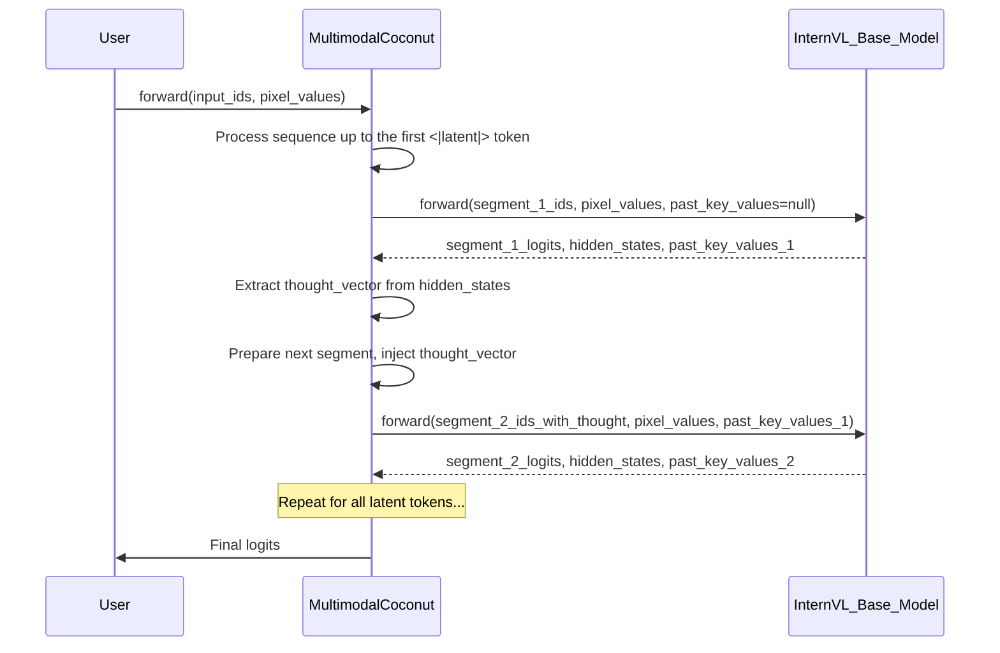

# Multimodal CoCoNuT Refactor Plan

This document outlines the analysis of the existing `multimodal-coconut` architecture and proposes a new design to address critical flaws.
## 1. Analysis of Existing Architecture

The current implementation of `MultimodalCoconut` suffers from three critical architectural flaws that compromise its reasoning capabilities, efficiency, and overall soundness.

### Flaw 1: Violation of Forward Pass Integrity and Causality

The core of this issue lies in the `_multimodal_forward_pass` function (lines 186-325) in `multimodal_coconut/model/multimodal_coconut.py`.

- **Problem**: The model performs a full forward pass on the entire input sequence at the beginning (lines 240-254). This pass includes tokens that appear *after* the `<|latent|>` tokens.
- **Impact**: This "full-pass-then-refine" approach contaminates the Key-Value (KV) cache with information from future tokens. The subsequent iterative refinement loop (lines 264-300) reuses this compromised KV cache, fundamentally violating the causal principle of autoregressive models. The model is essentially "cheating" by looking ahead.

### Flaw 2: Static vs. Dynamic Multimodal Reasoning

The architecture fails to enable dynamic interaction with the visual modality during the reasoning process.

- **Problem**: Visual information (`pixel_values`) is processed only once in the initial forward pass (lines 240-254). The iterative loop that is supposed to represent the "thought process" (lines 264-300) operates exclusively on textual hidden states. The `pixel_values` are not passed to the model during these refinement steps.
- **Impact**: The model cannot dynamically shift its visual focus or re-interrogate the image based on the intermediate thoughts it generates. This limits the depth of its multimodal reasoning, as the visual context is fixed from the start.

### Flaw 3: Architectural Unsoundness and Inefficiency

The combination of the above flaws leads to an inefficient and fundamentally unsound architecture.

- **Problem**: The repeated full forward passes over the sequence are computationally expensive and redundant. The KV cache, which is designed to prevent such recalculations, is misused. The `generate` function (lines 454-588) mirrors the flawed logic of the forward pass, extending the issues to the inference stage.
- **Impact**: The model is slow and produces faulty reasoning, as its internal states are corrupted by the causality violation. The architecture does not truly perform iterative reasoning but rather a flawed refinement of a pre-computed state.
## 2. Proposed Architecture: Iterative Multimodal Reasoning

To address the identified flaws, I propose a new architecture centered around a **truly iterative, sequentially dependent forward pass**. This design ensures causal integrity, enables dynamic multimodal reasoning, and improves efficiency.

### High-Level Overview

The new architecture will process the input sequence token by token (or chunk by chunk), respecting the causal flow. When a `<|latent|>` token is encountered, the model will use the hidden state of the *previous* token as the "thought vector" and feed it back into the model for the next step. Crucially, the visual information will be available at every step, allowing the model to re-interrogate the image as needed.

### Core Components and Interactions

1.  **Sequentially Aware Forward Pass**: The `_multimodal_forward_pass` will be rewritten to process the input sequence in segments, delimited by the `<|latent|>` tokens. It will not perform a full forward pass on the entire sequence at once.
2.  **Dynamic Visual Fusion**: At each step of the iterative process, both the current text token embeddings and the `pixel_values` will be passed to the `base_model`. This allows the model to attend to the visual information at every stage of the thought process.
3.  **Correct KV Cache Management**: The KV cache will be built up incrementally. At each step, the `past_key_values` from the previous step will be passed to the next, ensuring that the model only has access to past information.

### Sequence Diagram: Iterative Forward Pass

### Implementation Recommendations

1.  **Refactor `_multimodal_forward_pass`**:
    -   Replace the initial full forward pass with a loop that iterates through the input sequence, segmented by `<|latent|>` tokens.
    -   Inside the loop, call `self.base_model.forward()` for each segment.
    -   Pass the `pixel_values` to the `base_model` in *every* call within the loop.
    -   Maintain and pass the `past_key_values` from one iteration to the next.

2.  **Refactor `generate`**:
    -   The `generate` function should be refactored to use the new iterative forward pass logic.
    -   During autoregressive decoding, after all latent tokens are processed, the model should continue to have access to the `pixel_values` to inform the generation of each new token.

3.  **Remove Redundant Code**:
    -   The `_standard_multimodal_forward` function may become redundant if the new `_multimodal_forward_pass` can handle both cases (with and without latent tokens) efficiently.

By implementing these changes, the `multimodal-coconut` model will have a sound architectural foundation for true iterative and dynamic multimodal reasoning.